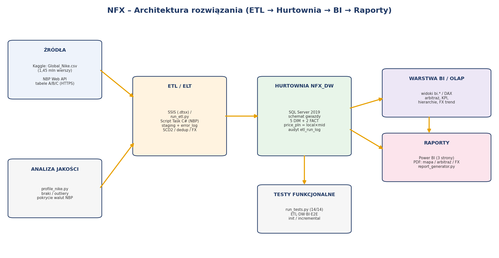
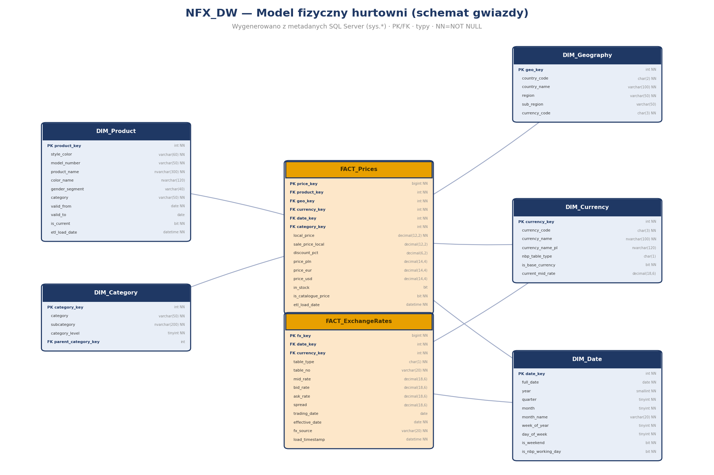

# NFX – Nike Foreign Exchange
## Dokumentacja finalna hurtowni danych (HiDBI)

**Autorzy:** Cezary Polkowski, Karol Socha · **Czerwiec 2026**
**Środowisko realizacji:** SQL Server 2019 Developer Edition · Python 3.11 (ETL/orkiestracja) · Power BI / matplotlib (raporty)

> Dokument opisuje **zrealizowane i przetestowane** rozwiązanie. Wszystkie liczby
> pochodzą z faktycznego załadowania danych do hurtowni `NFX_DW` i z przebiegu testów.

---

## 1. Cel projektu i korzyści dla odbiorcy

**Cel.** Zbudować hurtownię danych, która łączy globalny katalog cenowy Nike (ceny w
walutach lokalnych ~45 rynków) z dziennymi kursami walut NBP i pozwala wykrywać
**okazje arbitrażu cenowego** — produkty, które po przeliczeniu na PLN są istotnie
tańsze na jednym rynku niż na innym.

**Odbiorca:** zespół zakupowy / analityk e-commerce zajmujący się reeksportem i
optymalizacją zakupów międzyrynkowych.

**Korzyści:**
- jednolity widok ceny każdego produktu w PLN na wszystkich rynkach (eliminuje ręczne przeliczanie),
- automatyczny ranking okazji arbitrażowych (kup tanio / sprzedaj drogo) aktualizowany po każdym ETL,
- monitoring kursów NBP i ich zmienności jako kontekst decyzji zakupowych,
- pełna audytowalność (skąd pochodzi każda cena, jaki kurs zastosowano).

**Zrealizowany efekt (dane rzeczywiste):** spośród **29 249** produktów **11 771**
występuje na ≥2 rynkach; wykryto **9 227** okazji o marży >20% (maks. marża **894,5%**,
maks. spread **1 598 zł**).

---

## 2. Architektura rozwiązania

Przepływ: **Źródła → ETL/ELT → Hurtownia (konstelacja - 2 gwiazdy) → Warstwa BI (widoki/DAX) → Raporty**,
z poprzeczną **analizą jakości** (przed ETL) i **testami funkcjonalnymi** (po ETL).

| Warstwa | Technologia | Artefakt |
|---|---|---|
| Źródła | Kaggle CSV (1,45 mln w.), NBP Web API (HTTPS) | `Global_Nike.csv`, `api.nbp.pl` |
| Analiza jakości | Python/pandas | `05_data_profiling/profile_nike.py` |
| ETL/ELT | SSIS (.dtsx) + Script Task C#; uruchamialny odpowiednik w Python | `03_ssis/*`, `02_etl/*` |
| Hurtownia | SQL Server 2019, schemat gwiazdy | `01_sql/01..07*.sql` |
| OLAP/BI | Widoki `bi.*` + model/miary Power BI (DAX) | `01_sql/08_*`, `04_powerbi/*` |
| Raporty | Power BI (3 strony) / generator PDF | `07_reports/*` |
| Orkiestracja | SQL Server Agent | `01_sql/09_sql_agent_jobs.sql` |

**Decyzja architektoniczna (vs KM1):** SSIS nie ma natywnego źródła REST/JSON, więc
pobranie kursów NBP realizuje **Script Task w C#** (`HttpClient` + `System.Text.Json`,
HTTPS, segmentacja ≤90 dni). Model Power BI pełni rolę warstwy OLAP (kostki) — SSAS nie był wymagany.

---

## 3. Opis zbiorów danych

### 3.1 Źródło 1 — Nike Global Catalogue 2026 (Kaggle)
- **Dostęp:** publiczny (konto Kaggle), `bsthere/nike-global-catalogue-2026`, pobranie jednorazowe + odświeżanie kwartalne.
- **Format:** jeden plik `.csv`, UTF-8, separator `,`, qualifier `"`; **1 447 795 wierszy**, 35 kolumn, ~881 MB.
- **Ziarno źródła:** produkt × kraj × **rozmiar** (cena powtarza się dla rozmiarów) → w ETL deduplikowane do **produkt × kraj × data** (**175 917** wierszy).

**Rzeczywista struktura (zweryfikowana profilowaniem — różni się od założeń KM1):**

| Kolumna CSV | Rola w modelu | Uwaga |
|---|---|---|
| `style_color` | **klucz naturalny produktu** (model+kolor) | KM1 zakładał `sku` (tu UUID per rozmiar) |
| `model_number` | kod stylu | |
| `product_name` | nazwa modelu | zlokalizowana per rynek → bierzemy wariant US/EN |
| `color_name` | kolorystyka | |
| `gender_segment` | płeć (MEN/WOMEN/…) | |
| `category` / `subcategory` | kategoria / podkategoria | `subcategory` zlokalizowana (CJK) |
| `country_code` / `currency` | rynek / waluta lokalna | |
| `price_local` / `sale_price_local` / `discount_pct` | miary cenowe | |
| `in_stock` / `availability_level` | dostępność | |

### 3.2 Źródło 2 — NBP Web API (kursy walut)
- **Dostęp:** publiczny, bez klucza; **wyłącznie HTTPS** (od 2025-08-01). Base: `https://api.nbp.pl/api/`.
- **Format:** JSON; tabele **A** (kursy średnie, ~32 waluty), **B** (rzadsze, ~116), **C** (bid/ask).
- **Limit:** 1 zapytanie ≤ 93 dni → segmentacja na ≤90 dni.
- **Odświeżanie:** codziennie w dni robocze NBP (Job 07:00).
- **Pobrano (rzeczywiście):** zakres 2026-01-02 … 2026-06-12, **112 dni roboczych**, **7 708** wierszy kursów (A+B+C), **148** unikalnych walut.

---

## 4. Proces ETL — ekstrakcja, transformacja, ładowanie

Dwa logiczne pakiety (Control Flow w SSIS; uruchamialny odpowiednik `run_etl.py`):

### Pakiet #1 — katalog Nike (`Load_Nike_Catalogue.dtsx`)
1. `TRUNCATE staging.stg_nike_prices`.
2. **Data Flow** Flat File → staging: walidacja + **Error Redirect** (price ≤ 0 / NULL / style_color NULL → `staging.error_log` z `reject_reason`).
3. Ładowanie wymiarów i faktu (procedury T-SQL `Execute SQL Task`):
   - `usp_LoadDimCategory` — hierarchia Category→Subcategory,
   - `usp_LoadDimProduct_SCD2` — **SCD Typ 2** (zmiana `product_name`/`color_name`/`gender`/`category`/`model_number` → zamknięcie starego rekordu `valid_to`+`is_current=0` i wstawienie nowego),
   - `usp_LoadFactPrices` — wstawienie do `FACT_Prices` + **przeliczenie cen**.

### Pakiet #2 — kursy NBP (`Load_NBP_FX.dtsx`)
1. **Script Task (C#)** — pobiera tabele A/B (segmentacja ≤90 dni, HTTPS, 404=dzień wolny pomijany) → `staging.stg_fx_rates`.
2. `usp_LoadDimCurrency` (słownik + nazwy EN/PL + PLN bazowa), `usp_LoadFactExchangeRates` (**deduplikacja** `WHERE NOT EXISTS` po `effective_date+currency+table_type`, obliczenie `spread`, **SCD1** `current_mid_rate`), `usp_RefreshNbpWorkingDays`.

### Kluczowe transformacje i integracja
- **Przeliczenie na PLN:** `price_pln = local_price × mid_rate`, gdzie `mid_rate` to ostatni
  kurs tabeli A/B **≤ data snapshotu** dla danej waluty (PLN=1). Weryfikacja: USD 110 × 3,727 = **409,97 zł** (test T-DW-02, odchylenie ≤ 0,001).
- **Kursy krzyżowe:** `price_eur = price_pln / mid_EUR`, `price_usd = price_pln / mid_USD`.
- **Integracja po kodach:** `country_code→geo_key`, `currency→currency_key`, `(category,subcategory)→category_key`, `style_color→product_key`.
- **Higiena:** pusta podkategoria → `(Unspecified)`; kolumny zlokalizowane jako `NVARCHAR` (poprawne CJK).

### Scenariusze ładowania (przetestowane)
| Scenariusz | Komenda | Dowód |
|---|---|---|
| Inicjalizacja (full) | `run_etl.py --mode initial` | `etl_run_log` run 1, SUCCESS, 16 s, 183 607 wierszy faktów |
| Kolejna iteracja (incremental) | `run_etl.py --mode incremental` | `etl_run_log` run 2, SUCCESS, 12 s, **bez przyrostu** (dedup), test T-INC-01 |

---

## 5. Model fizyczny hurtowni

Schemat gwiazdy: 5 wymiarów + 2 tabele faktów (`dw.*`). Pełny DDL z typami, wymagalnością
i relacjami: `01_sql/02_dim_tables.sql`, `03_fact_tables.sql`. Liczby wierszy po załadowaniu:

| Tabela | Wiersze | Rola |
|---|---|---|
| `DIM_Date` | 9 496 | data (2002–2027), `is_nbp_working_day` |
| `DIM_Currency` | 150 | waluta (SCD1 `current_mid_rate`), `is_base_currency` (PLN) |
| `DIM_Geography` | 45 | rynek, region Nike, waluta wiodąca |
| `DIM_Category` | 48 458 | hierarchia Category→Subcategory (podkat. zlokalizowane) |
| `DIM_Product` | 29 249 | produkt (SCD2, klucz `style_color`) |
| `FACT_Prices` | 175 899 | produkt × kraj × data; `local_price`, `price_pln/eur/usd` |
| `FACT_ExchangeRates` | 7 708 | waluta × dzień × tabela; `mid/bid/ask/spread` |

Klucze obce: `FACT_Prices` → 5 wymiarów; `FACT_ExchangeRates` → `DIM_Date`, `DIM_Currency`.
`DIM_Date` i `DIM_Currency` to wymiary współdzielone (conformed).

---

## 6. Kluczowe miary, widoki, atrybuty i hierarchie

**Miary (pełna lista DAX: `04_powerbi/measures.dax`):**
`Price PLN (snapshot)`, `Avg Price PLN`, `Cena PLN (dynamiczna)`, `Min/Max cena rynek PLN`,
`Spread PLN`, `Marza %`, `Aktywne okazje (>20%)`, `Najtanszy/Najdrozszy rynek`,
`Mid kurs`, `Zmiana kursu 30D %`, `Spread walutowy %`, `Zmiennosc kursu (stdev)`.

**Widoki warstwy BI (schemat `bi`):** model biznesowy zmaterializowany jako 7 widoków nad gwiazdą `dw.*` (definicje: `01_sql/08_analytical_views.sql`). Stanowią warstwę dostępu/semantyczną dla Power BI i generatora raportów PDF.

| Widok | Ziarno | Co zwraca / rola | Zasila |
|---|---|---|---|
| `bi.v_price_enriched` | produkt × kraj × data | Zdenormalizowany fakt cen + wszystkie atrybuty wymiarów (kategoria, region, waluta, daty) + flaga `is_price_outlier`. Podstawowa „płaska" tabela analityczna. | model szczegółowy, ad-hoc |
| `bi.v_global_price_map` | produkt × kraj | Cena lokalna i `price_pln` każdego produktu na każdym rynku (outliery >50 000 PLN odcięte). | Strona 1 – mapa/słupki cen |
| `bi.v_product_arbitrage` | produkt | Ranking arbitrażu: liczba rynków, najtańszy/najdroższy rynek (`cheapest_cc`/`dearest_cc`), `min/max/avg_price_pln`, `spread_pln`, `margin_pct`, `arbitrage_status` (HIGH/MEDIUM/LOW). | Strona 2 – ranking, słupki, karty KPI |
| `bi.v_fx_enriched` | waluta × dzień × tabela | Kursy NBP + atrybuty daty (rok/kwartał/miesiąc), `mid/bid/ask/spread`, typ tabeli. | Strona 3 – wykres liniowy historii kursów |
| `bi.v_fx_trend_30d` | waluta (tab. A) | Kurs bieżący vs sprzed 30 dni: `mid_now`, `mid_30d_ago`, `change_30d_pct`. | Strony 2–3 – panel FX, karty trendu |
| `bi.v_fx_monthly_volatility` | waluta × miesiąc | Zmienność miesięczna: `vol_stdev`, `vol_avg`, `vol_cv_pct` (wsp. zmienności = stdev/avg). | Strona 3 – heatmapa zmienności |
| `bi.v_kpi_summary` | 1 wiersz (globalny) | Zbiorcze KPI: liczba produktów/rynków/walut, wiersze faktów, `arbitrage_products`, `opportunities_gt20`, `max_margin_pct`, `max_spread_pln`. | Karty KPI (wszystkie strony) |

> **Reguła jakości w warstwie BI:** widoki arbitrażu i mapy wykluczają ceny-sentinele (`price_pln > 50 000` — placeholdery 100 000 NZD). Surowe wartości pozostają w `FACT_Prices` (audytowalność); centralizacja reguły w jednym miejscu to jedna z zalet warstwy widoków.

**Atrybuty / SCD:** `DIM_Product` — SCD2 (śledzone: nazwa, kolor, płeć, kategoria, model_number);
`DIM_Currency` — SCD1 (`current_mid_rate` nadpisywany co dzień).

**Hierarchie:**
- `DIM_Category`: **Category → Subcategory** (FOOTWEAR/APPAREL/EQUIPMENT → podkategorie),
- `DIM_Geography`: **Region → Sub-Region → Country** (segmenty Nike: NA/EMEA/Greater China/APLA),
- `DIM_Date`: **Year → Quarter → Month → Day**.

---

## 7. Warstwa raportowa (model biznesowy)

- **Dostęp:** Power BI Desktop → SQL Server `NFX_DW`, **tryb Import** (odświeżanie po ETL). M-skrypty: `04_powerbi/powerquery_sources.m`.
- **Model biznesowy:** 7 tabel, relacje 1:* (wymiar→fakt), filtr pojedynczy; opis: `04_powerbi/model_description.md`.
- **Transformacje w warstwie raportowej:**
  - wykluczenie outlierów `price_pln > 50 000` (sentinele 100000 NZD; w danych czysta luka 5k–100k),
  - dynamiczne przeliczenie po dacie (`Mid kurs`, `Cena PLN (dynamiczna)`),
  - pasma statusu arbitrażu i formatowanie warunkowe (zielony/żółty/czerwony).

---

## 8. Realizacja przykładowych raportów

Trzy strony (opis „jak czytać": `07_reports/README_reports.md`, podglądy `.png`, pliki `.pdf`):

1. **Global Price Map** — cena modelu w PLN wg rynku (np. *Nike Vomero 18 By You*, 39 rynków: Japonia 464 zł → Szwajcaria 1033 zł, marża 123%).
2. **Arbitrage Opportunities** (raport główny) — KPI (maks. spread 1 598 zł, maks. marża 894%, 9 227 okazji >20%), TOP-10 ranking z formatowaniem warunkowym, panel FX, wykres marży.
3. **FX Dashboard** — trend 30D (najsilniejszy ZAR +2,3%, najsłabszy BRL −3,1%), wykres historii kursów, heatmapa zmienności miesięcznej.

---

## 9. Podsumowanie rezultatów (perspektywa biznesowa)

| Wskaźnik | Wartość |
|---|---|
| Produkty w hurtowni | 29 249 |
| Rynki / waluty | 45 / 28 |
| Produkty na ≥2 rynkach (porównywalne) | 11 771 |
| **Okazje arbitrażowe >20% marży** | **9 227** |
| Maks. marża arbitrażu | 894,5% |
| Maks. spread | 1 598 zł |
| Wiersze faktów cen | 175 899 (18 odrzuconych — ceny ≤0) |
| Kursy NBP | 7 708 (112 dni, 148 walut) |
| Jakość ładowania | 14/14 testów PASS, 0 osieroconych kluczy |

**Wniosek biznesowy:** dane potwierdzają istotny i powtarzalny potencjał arbitrażu —
rynki o słabszych walutach (Turcja, Filipiny, Indonezja) są systematycznie najtańsze w PLN,
a rynki „drogie" (Szwajcaria, Meksyk, RPA, kraje nordyckie) najdroższe. Rozwiązanie
dostarcza gotowy, odświeżalny ranking, na którym odbiorca może podejmować decyzje zakupowe.
**Ograniczenia:** ceny katalogowe to jeden snapshot (2026-03-19); pełna analiza „w czasie"
wymaga kolejnych snapshotów katalogu (kursy są już historyczne). Skrajne marże dla drobnych
akcesoriów (EQUIPMENT) należy filtrować progiem wartości.

---

## 10. Podział pracy w zespole

| Obszar | Projekt | Implementacja | Testy | Dokumentacja |
|---|---|---|---|---|
| Model hurtowni / DDL | C. Polkowski | C. Polkowski | wspólnie | C. Polkowski |
| ETL (SSIS/Script Task/orkiestracja) | wspólnie | C. Polkowski | C. Polkowski | wspólnie |
| Pozyskanie danych + jakość | C. Polkowski | K. Socha | K. Socha | K. Socha |
| Warstwa BI / miary / raporty | K. Socha | K. Socha | wspólnie | K. Socha |
| Testy funkcjonalne (zestaw) | wspólnie | wspólnie | wspólnie | wspólnie |

---

### Załączniki / mapa repozytorium
`01_sql/` DDL+procedury+widoki+joby · `02_etl/` fetcher NBP + orkiestrator · `03_ssis/` C#+przewodnik ·
`04_powerbi/` DAX+M+opis modelu · `05_data_profiling/` profiler+raport jakości ·
`06_tests/` testy (SQL+Python)+wyniki · `07_reports/` PDF+podglądy · `08_docs/` ta dokumentacja+diagramy ·
`sample_data/` próbka · `_evidence/` logi i zrzuty kontrolne.
